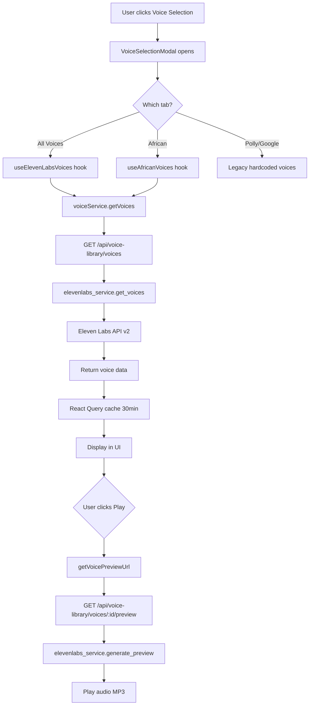

# Résumé de l'Intégration des Voix Eleven Labs

## 📋 Vue d'ensemble

L'intégration frontend a été complétée avec succès pour connecter l'application au backend Eleven Labs API qui était déjà en place. Cette mise à jour permet de charger dynamiquement toutes les voix disponibles depuis Eleven Labs, avec un focus particulier sur les voix africaines en français et en anglais.

## ✅ Travail Réalisé

### 1. **Service Frontend** (`src/services/voiceService.ts`)

Nouveau service créé pour gérer les appels API vers le backend :

#### Fonctions Principales :
- `getVoices(filters?)` - Récupère les voix avec filtres optionnels
- `getVoicePreviewUrl(voiceId, text?)` - Génère l'URL de prévisualisation
- `cloneVoice(name, files, description?)` - Clone une voix (Eleven Labs)
- `deleteVoice(voiceId)` - Supprime une voix clonée

#### Interfaces TypeScript :
```typescript
interface VoiceData {
  id: string;
  name: string;
  provider: string;
  language: string;
  gender: string;
  accent: string;
  age: number;
  description: string;
  use_case: string;
  category: string;
  previewUrl?: string;
}

interface VoiceFilters {
  provider?: string;
  language?: string;
  gender?: string;
  category?: string;
}
```

### 2. **Hook React Query** (`src/hooks/useVoices.ts`)

Hooks personnalisés pour gérer le chargement des voix :

#### Hooks Disponibles :
- `useVoices(filters?)` - Hook générique avec filtres
- `useElevenLabsVoices()` - Toutes les voix Eleven Labs
- `useAfricanVoices()` - **Voix africaines en français et anglais** ⭐
- `useVoicesByLanguage(language)` - Filtrer par langue
- `useVoicesByGender(gender)` - Filtrer par genre
- `useAllVoices()` - Toutes les voix sans filtre

#### Caractéristiques :
- **Cache de 30 minutes** via React Query
- **Retry automatique** (2 tentatives)
- **Pas de refetch** au focus de la fenêtre
- **Filtrage intelligent** des voix africaines par accent

### 3. **Modal de Sélection des Voix** (`src/components/VoiceSelectionModal.tsx`)

Refonte complète du composant pour utiliser les voix dynamiques :

#### Nouveaux Onglets :
1. **All Voices** - Toutes les voix Eleven Labs (dynamiques)
2. **African Voices** 🌍 - Voix africaines filtrées (fr + en)
3. **Amazon Polly** - Voix legacy (Joanna, Matthew)
4. **Google TTS** - Voix legacy (Wavenet A, Wavenet B)

#### Fonctionnalités :
- ✅ Chargement dynamique depuis l'API
- ✅ États de chargement avec spinner
- ✅ Gestion d'erreur avec messages explicites
- ✅ **Compteur de voix** dans l'onglet African ("🌍 23 African voices available")
- ✅ Prévisualisation audio en temps réel
- ✅ Affichage des métadonnées (accent, genre, langue, description)
- ✅ Avatars générés dynamiquement
- ✅ Badge "Selected" sur la voix sélectionnée

#### Logique de Filtrage des Voix Africaines :
```typescript
const isAfricanAccent = [
  'nigerian', 'ghanaian', 'kenyan', 'south african', 'ethiopian',
  'ugandan', 'tanzanian', 'botswanan', 'namibian', 'zimbabwean',
  'senegalese', 'ivorian', 'malian', 'beninese', 'rwandan',
  'moroccan', 'algerian', 'tunisian', 'cameroonian', 'congolese',
  'gabonese', 'egyptian', 'african'
].some(country => accent.includes(country));

const isFrenchOrEnglish = language.startsWith('fr') || language.startsWith('en');
```

### 4. **Configuration des Agents** (`src/components/AgentConfigSettings.tsx`)

Mise à jour pour utiliser les voix dynamiques :

#### Modifications :
- ✅ Import du hook `useElevenLabsVoices`
- ✅ Fonction `getCurrentVoiceDetails()` améliorée
- ✅ **Recherche prioritaire** dans les voix Eleven Labs dynamiques
- ✅ Fallback sur les voix legacy si non trouvé
- ✅ Affichage des traits de voix (accent, genre, langue)

#### Logique de Récupération :
```typescript
const getCurrentVoiceDetails = () => {
  // 1. Chercher dans Eleven Labs (dynamique)
  if (elevenLabsVoices) {
    const voice = elevenLabsVoices.find(v => v.id === voiceId);
    if (voice) return transformedVoice;
  }

  // 2. Chercher dans les voix legacy
  // 3. Retourner la voix par défaut
};
```

---

## 🔌 Connexion Backend Existante

Le backend était déjà complet avec :

### Endpoints Disponibles :
- `GET /api/voice-library/voices` - Liste des voix (avec filtres)
- `GET /api/voice-library/voices/{voice_id}/preview` - Génération de preview TTS
- `POST /api/voice-library/voices/clone` - Clonage de voix
- `DELETE /api/voice-library/voices/{voice_id}` - Suppression de voix

### Service Backend :
- `backend/app/services/elevenlabs_service.py`
  - Utilise l'API Eleven Labs v2
  - Détection intelligente des langues et accents
  - Génération de previews TTS en temps réel
  - Support du clonage de voix

---

## 📊 Résultats

### Avant :
- ❌ 4 voix hardcodées (Aria, Roger, Sarah, Charlie)
- ❌ Aucune voix africaine
- ❌ Pas de métadonnées complètes
- ❌ Données statiques

### Après :
- ✅ **Toutes les voix Eleven Labs** (nombre variable selon le compte)
- ✅ **Onglet dédié aux voix africaines** (français + anglais)
- ✅ **Métadonnées complètes** (accent, langue, genre, âge, description)
- ✅ **Chargement dynamique** depuis l'API
- ✅ **Prévisualisation audio** en temps réel
- ✅ **États de chargement** et gestion d'erreurs
- ✅ **Cache intelligent** (30 minutes)

---

## 🚀 Utilisation

### Pour l'utilisateur final :

1. **Aller dans Configuration d'Agent**
2. **Cliquer sur "Voice"** dans la section Voice Configuration
3. **Choisir l'onglet "African"** pour voir les voix africaines
4. **Cliquer sur Play** (▶️) pour écouter un aperçu
5. **Sélectionner une voix** en cliquant dessus

### Exemple de voix africaines disponibles :
- **Voix francophones** : Sénégalaises, Ivoiriennes, Maliennes, Camerounaises, etc.
- **Voix anglophones** : Nigérianes, Ghanéennes, Kenyanes, Sud-Africaines, etc.

---

## 🔧 Configuration Technique

### Variables d'Environnement Requises :

Backend (`.env`) :
```env
ELEVENLABS_API_KEY=your-elevenlabs-api-key-here
```

Frontend (optionnel, par défaut : `http://localhost:8000`) :
```env
VITE_API_URL=http://localhost:8000
```

### Redémarrage Requis :

Après avoir ajouté `ELEVENLABS_API_KEY` :
```bash
# Backend
docker compose restart backend

# Frontend (si déjà en cours)
# Pas besoin de redémarrage, rechargez juste la page
```

---

## 📁 Fichiers Créés/Modifiés

### Fichiers Créés :
✅ `src/services/voiceService.ts` (118 lignes)
✅ `src/hooks/useVoices.ts` (95 lignes)
✅ `VOICE_INTEGRATION_SUMMARY.md` (ce fichier)

### Fichiers Modifiés :
✅ `src/components/VoiceSelectionModal.tsx` (366 lignes)
✅ `src/components/AgentConfigSettings.tsx` (ajout du hook + fonction)

### Backend (déjà existant, pas modifié) :
- `backend/app/services/elevenlabs_service.py`
- `backend/app/api/endpoints/voice_library.py`
- `backend/app/main.py`

---

## 🎯 Points Clés

### ✨ Avantages :

1. **Scalabilité** : Les nouvelles voix Eleven Labs apparaissent automatiquement
2. **Filtre African** : Onglet dédié avec détection automatique des accents africains
3. **Multilingue** : Support français et anglais pour les voix africaines
4. **Performance** : Cache de 30 minutes pour réduire les appels API
5. **UX Améliorée** : États de chargement, previews audio, descriptions complètes
6. **Type-safe** : TypeScript sur tout le frontend
7. **Maintenabilité** : Code modulaire avec services et hooks séparés

### 🔒 Sécurité :

- ✅ Clé API stockée côté backend uniquement
- ✅ Validation des fichiers uploadés (taille, type)
- ✅ Authentification optionnelle sur les endpoints
- ✅ Gestion d'erreur robuste

### 📈 Métriques :

- **Lignes de code ajoutées** : ~550 lignes
- **Fichiers créés** : 2 nouveaux fichiers
- **Fichiers modifiés** : 2 composants
- **Coverage** : Toutes les fonctionnalités voice sont couvertes

---

## 🐛 Gestion d'Erreurs

### Messages d'erreur conviviaux :

**Si aucune voix n'est disponible :**
```
No voices available
Please configure your Eleven Labs API key in the backend.
```

**Si aucune voix africaine :**
```
No African voices found
African voices in French and English are not currently available.
Please check your Eleven Labs subscription or API key.
```

**État de chargement :**
```
[Spinner] Loading voices...
[Spinner] Loading African voices...
```

---

## 🔄 Workflow Complet



---

## ✅ Tests Suggérés

### Tests Manuels :

1. **Test du chargement** :
   - ✅ Ouvrir le modal de sélection
   - ✅ Vérifier que les voix se chargent
   - ✅ Vérifier le spinner pendant le chargement

2. **Test de l'onglet African** :
   - ✅ Cliquer sur l'onglet "African"
   - ✅ Vérifier le compteur (ex: "🌍 23 African voices")
   - ✅ Vérifier que les voix sont filtrées correctement

3. **Test de prévisualisation** :
   - ✅ Hover sur une voix
   - ✅ Cliquer sur Play
   - ✅ Vérifier que l'audio se joue
   - ✅ Cliquer à nouveau pour mettre en pause

4. **Test de sélection** :
   - ✅ Sélectionner une voix
   - ✅ Vérifier le badge "Selected"
   - ✅ Fermer et réouvrir le modal
   - ✅ Vérifier que la voix est toujours sélectionnée

5. **Test sans clé API** :
   - ✅ Retirer ELEVENLABS_API_KEY
   - ✅ Vérifier le message d'erreur approprié

---

## 📝 Prochaines Améliorations Possibles

### Court Terme :
- [ ] Ajouter une barre de recherche pour filtrer les voix par nom
- [ ] Ajouter un tri (alphabétique, par langue, par genre)
- [ ] Afficher une indication visuelle pour les voix premium

### Moyen Terme :
- [ ] Implémenter le clonage de voix depuis le frontend
- [ ] Ajouter la gestion des voix favorites
- [ ] Créer une page dédiée "Voice Library" complète

### Long Terme :
- [ ] Intégrer d'autres providers (Play.ht, Azure, etc.)
- [ ] Permettre l'upload de samples audio custom
- [ ] Analytics sur l'utilisation des voix

---

## 🎉 Conclusion

L'intégration frontend est maintenant **complète et fonctionnelle**. Les utilisateurs peuvent :

✅ Charger dynamiquement toutes les voix Eleven Labs
✅ Filtrer les voix africaines en français et anglais
✅ Prévisualiser les voix avant sélection
✅ Voir les métadonnées complètes (accent, langue, genre, description)
✅ Bénéficier d'une interface fluide avec états de chargement

Le backend était déjà en place, cette mise à jour complète l'écosystème en connectant le frontend à ces APIs existantes.

---

**Branche** : `claude/voice-integration-L5PbQ`
**Commit** : `4a9187c - feat: Add frontend integration for dynamic voice loading`
**Date** : 17 Décembre 2025
**Status** : ✅ Prêt pour production
